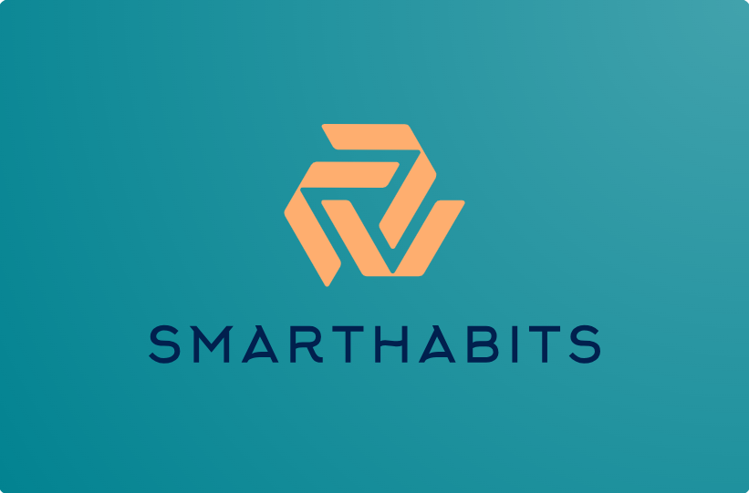

<h1  align="center">
SmartHabits
 
Proyecto Intermedio de
  
Diseño de Interfaces de Usuario
</h1>

<h2 align="center">Equipo 5: KirbyCreatives</h2>

  

## Desarrolladores

- *Diseño* - [Altamirano Niño Luis Enrique](https://github.com/quiquealtni)
- *Técnico* - [Abundes Gutiérrez Irving Miguel](https://github.com/mikeAbundes23)
- *Herramientas* - [López Carrillo Alan Ignacio](https://github.com/AlanLopezC)
- *Calidad / Pruebas* - [Vázquez Dávila José Adolfo](https://github.com/Jose117053)
- *Líder* - [Villafán Flores María Fernanda](https://github.com/FernandaVillafan)

## Tecnologías utilizadas (Generales)
Tecnología | Versión
----- | ----
Django | 5.1.1
Python | 3.11.4
Neon | - 
PostgreSQL | 16
Bootstrap | -

## Tecnologías utilizadas (Back-End)
Package                       | Versión
----------------------------- | -----------
asgiref                       |3.8.1
boto3                         |1.35.30
botocore                      |1.35.30
Django                        |5.1.1
django-model-utils            |5.0.0
djangorestframework           |3.15.2
djangorestframework-simplejwt |5.3.1
jmespath                      |1.0.1
pip                           |24.2
psycopg2                      |2.9.9
PyJWT                         |2.9.0
python-dateutil               |2.9.0.post0
python-dotenv                 |1.0.1
s3transfer                    |0.10.2
setuptools                    |65.5.0
six                           |1.16.0
sqlparse                      |0.5.1
tzdata                        |2024.2
urllib3                       |2.2.3

## Instalación

En una terminal, clonar el repositorio de GitHub: `git clone git@github.com:mikeAbundes23/Proyecto-Intermedio-DIU.git`.

Entrar a la carpeta ***Proyecto-Intermedio-DIU***: `cd Proyecto-Intermedio-DIU`.

## Librerías necesarias para correr el Back-End

Crear un entorno virtual: `python3 -m venv venv`.

Activar el entorno virtual: `source ./venv/bin/activate`.

Navegar al directorio ***backend***: `cd backend`.

Instalar las dependencias necesarias para correr el Back-End: `pip install -r requirements.txt`.

## Librerías necesarias para correr el Front-End

En una terminal, instalar las dependencias necesarias para correr el Front-End: `npm install`.

## Base de Datos

Se encuentra en la siguiente página de [Neon](https://neon.tech/), donde con el ***correo:*** `smarthabits24@gmail.com` y la ***contraseña:*** `SmartHabits23#23` se puede ver toda la estructura de la Base de Datos.

## Ejecución del Proyecto

Una vez instalado todas las librerías necesarias para correr el proyecto, es necesario realizar los siguientes pasos para su correcta ejecución:
1. Para la base de datos no es necesario configurar nada, pues ya se tienen las credenciales necesarias ya cargadas para utilizar la BD en el proyecto.
2. Dentro del entorno virtual ya creado, ir dentro del directorio ***smart_habits*** con  `cd smart_habits`.
3. Ejecutar el Back-End con `python manage.py runserver`.
   * Si la instalación se cumplió en su totalidad, entonces el _Back-End_ debería empezar a ejecutarse.
4. Será necesario tener otra terminal para correr el Front-End:
   * Después de haber instalado las librerías necesarias:
   	* En una terminal, ir al directorio ***smarthabits-ui*** con `cd smarthabits-ui`.
   * Ejecutar el Front-End con `npm start`.
		* Igualmente, si la instalación se realizó de manera correcta, entonces el programa ya debería estar ejecutándose.

## Uso de la aplicación
Para poder acceder al sitio web, solo necesitamos redirigirnos a la siguiente página `[HOME](http://localhost:3000/)` con la que ya podemos empezar a interactuar.

- Aquí podemos encontrar un usuario que ya está registrado en la base de datos con el que podremos iniciar sesión:

__username :__ `irving_abundes`

__password :__ `12345678`
